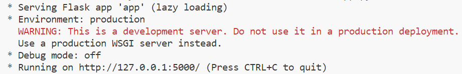
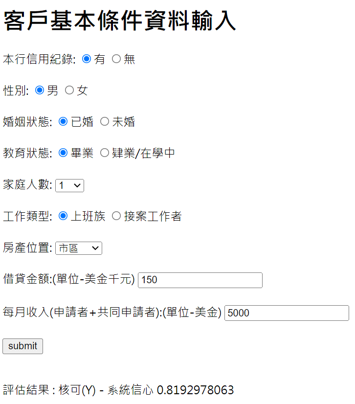
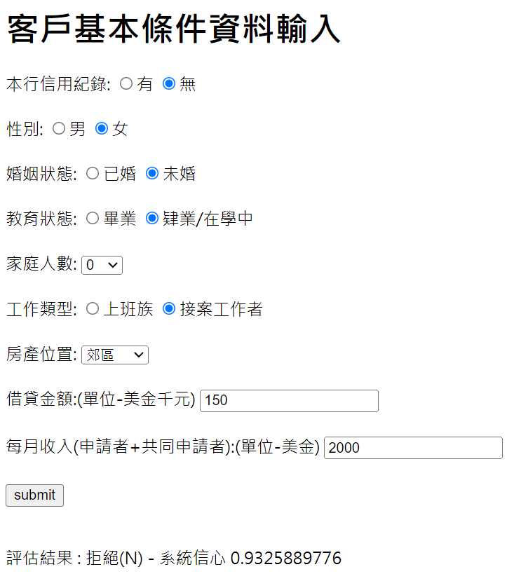

## 機器學習 + 使用者介面
## 以Loan Prediction為例
&nbsp;

Ryan Chung 🧑
---
## 原本的銀行放款評估程式
* 匯出訓練好的模型

```python
outcome_var = 'Loan_Status'
model = LogisticRegression()
predictor_var = ['Credit_History','Gender','Married','Education','Dependents','Self_Employed','Property_Area','LoanAmount_log','TotalIncome_log']
loan_model(model, df, predictor_var, outcome_var, 0.3, 66)

#Export model
import joblib
joblib.dump(model,'LoanOrNot-LR-YYYYMMDD.pkl',compress=3)
```
---
## 建立新的Web專案
* 新增資料夾，命名為loan-prediction-web
* 將前一頁產生的LoanOrNot-LR-YYYYMMDD.pkl放在資料夾中
* 建立檔案 app.py
---
app.py
``` python [1-6|8-10|12-22|23-36|37-43|44-56|57-63|64-73|74-83|84-96]
import joblib
model_pretrained = joblib.load('LoanOrNot-LR-YYYYMMDD.pkl')
import numpy as np
 
from flask import Flask, request, render_template
app = Flask(__name__)

@app.route("/")
def formPage():
    return render_template('form.html')
 
@app.route("/submit", methods=['POST'])
def submit():
    if request.method == 'POST':
        form_data = request.form
        #Credit_History
        Credit_History_Yes = ''
        Credit_History_No = ''
        if int(form_data['Credit_History']) == 1:
            Credit_History_Yes = 'checked'
        else:
            Credit_History_No = 'checked'
        #Gender
        Gender_Male = ''
        Gender_Female = ''
        if int(form_data['Gender'])== 1:
            Gender_Male = 'checked'
        else:
            Gender_Female = 'checked'
        #Married
        Married_Yes = ''
        Married_No = ''
        if int(form_data['Married']) == 1:
            Married_Yes = 'checked'
        else:
            Married_No = 'checked'
        #Education
        Education_Graduate = ''
        Education_NotGraduate = ''
        if int(form_data['Education']) == 0:
            Education_Graduate = 'checked'
        else:
            Education_NotGraduate = 'checked'
        #Dependents
        Dependents_0 = ''
        Dependents_1 = ''
        Dependents_2 = ''
        Dependents_3Plus = ''
        if int(form_data['Dependents']) == 0:
            Dependents_0 = 'selected'
        elif int(form_data['Dependents']) == 1:
            Dependents_1 = 'selected'
        elif int(form_data['Dependents']) == 2:
            Dependents_2 = 'selected'
        else:
            Dependents_3Plus = 'selected'
        #Self_Employed
        Self_Employed_No = ''
        Self_Employed_Yes = ''
        if int(form_data['Self_Employed']) == 0:
            Self_Employed_No = 'checked'
        else:
            Self_Employed_Yes = 'checked'
        #Property_Area
        Property_Area_Rural = ''
        Property_Area_Semiurban = ''
        Property_Area_Urban = ''
        if int(form_data['Property_Area']) == 0:
            Property_Area_Rural = 'selected'
        elif int(form_data['Property_Area']) == 1:
            Property_Area_Semiurban = 'selected'
        else:
            Property_Area_Urban = 'selected'
        # ['Credit_History','Gender','Married','Education','Dependents','Self_Employed','Property_Area','LoanAmount_log','TotalIncome_log']
        # model_pretrained.predict([[0,1,1,0,3,1,2,np.log(150),np.log(5000)]])
        result = model_pretrained.predict([[int(form_data['Credit_History']),int(form_data['Gender']),int(form_data['Married']),int(form_data['Education']),int(form_data['Dependents']),int(form_data['Self_Employed']),int(form_data['Property_Area']),np.log(int(form_data['LoanAmount'])),np.log(int(form_data['TotalIncome']))]])
        result_proba = model_pretrained.predict_proba([[int(form_data['Credit_History']),int(form_data['Gender']),int(form_data['Married']),int(form_data['Education']),int(form_data['Dependents']),int(form_data['Self_Employed']),int(form_data['Property_Area']),np.log(int(form_data['LoanAmount'])),np.log(int(form_data['TotalIncome']))]])
        print(f'Result:{result}')
        print(f'Result_Proba:{result_proba}')
        if result[0] == 1:
            prediction = f'核可(Y) - 系統信心 {result_proba[0][1]:.10f}'
        else:
            prediction = f'拒絕(N) - 系統信心 {result_proba[0][0]:.10f}'
        return render_template('form.html', 
        Credit_History_Yes = Credit_History_Yes, Credit_History_No = Credit_History_No, 
        Gender_Male = Gender_Male, Gender_Female = Gender_Female, 
        Married_Yes = Married_Yes, Married_No = Married_No, 
        Education_Graduate = Education_Graduate, Education_NotGraduate = Education_NotGraduate, 
        Dependents_0 = Dependents_0,Dependents_1 = Dependents_1,Dependents_2 = Dependents_2,Dependents_3Plus = Dependents_3Plus,
        Self_Employed_No = Self_Employed_No,Self_Employed_Yes = Self_Employed_Yes,
        Property_Area_Rural = Property_Area_Rural,Property_Area_Semiurban = Property_Area_Semiurban,Property_Area_Urban = Property_Area_Urban,
        LoanAmount = form_data['LoanAmount'],TotalIncome = form_data['TotalIncome']
        ,prediction = prediction)
 
if __name__ == "__main__":
    app.run()
```
Note:
* 為了將使用者的輸入保留在畫面上
* 依據輸入是radio->checked, select->selected保留使用者輸入
* 將表單輸入值送進model_pretrained.predict
* predict_proba可以看到各項目的信心指數(機率值)
---
網頁檔案
* 新建templates資料夾，裡面放form.html內容如下

```html [1-14|15-26|27-38|39-51|52-57]
<!DOCTYPE html>
<html>
    <head>
        <meta charset="utf-8">
        <title></title>
    </head>
    <body>
        <!-- # ['Credit_History','Gender','Married','Education','Dependents','Self_Employed','Property_Area','LoanAmount_log','TotalIncome_log'] -->
        <h1>客戶基本條件資料輸入</h1>
        <form action="/submit" method="post" enctype="multipart/form-data">
            <label for="Credit_History">本行信用紀錄:</label>
            <input type="radio" id="Credit_History" name="Credit_History" value="1" {{Credit_History_Yes}}><label for="Credit_History_Yes">有</label>
            <input type="radio" id="Credit_History" name="Credit_History" value="0" {{Credit_History_No}}><label for="Credit_History_No">無</label>
            <br><br>
            <label for="Gender">性別:</label>
            <input type="radio" id="Gender" name="Gender" value="1" {{Gender_Male}}><label for="Gender_Male">男</label>
            <input type="radio" id="Gender" name="Gender" value="0" {{Gender_Female}}><label for="Gender_Female">女</label>
            <br><br>
            <label for="Married">婚姻狀態:</label>
            <input type="radio" id="Married" name="Married" value="1" {{Married_Yes}}><label for="Married_Yes">已婚</label>
            <input type="radio" id="Married" name="Married" value="0" {{Married_No}}><label for="Married_No">未婚</label>
            <br><br>
            <label for="Education">教育狀態:</label>
            <input type="radio" id="Education" name="Education" value="0" {{Education_Graduate}}><label for="Education_Graduate">畢業</label>
            <input type="radio" id="Education" name="Education" value="1" {{Education_NotGraduate}}><label for="Education_NotGraduate">肄業/在學中</label>
            <br><br>
            <label for="Dependents">家庭人數:</label>
            <select name="Dependents" id="Dependents">
                <option value="0" {{Dependents_0}}>0</option>
                <option value="1" {{Dependents_1}}>1</option>
                <option value="2" {{Dependents_2}}>2</option>
                <option value="3" {{Dependents_3Plus}}>3+</option>
            </select>
            <br><br>
            <label for="Self_Employed">工作類型:</label>
            <input type="radio" id="Self_Employed" name="Self_Employed" value="0" {{Self_Employed_No}}><label for="Self_Employed_No">上班族</label>
            <input type="radio" id="Self_Employed" name="Self_Employed" value="1" {{Self_Employed_Yes}}><label for="Self_Employed_Yes">接案工作者</label>
            <br><br>
            <label for="Property_Area">房產位置:</label>
            <select name="Property_Area" id="Property_Area">
                <option value="0" {{Property_Area_Rural}}>郊區</option>
                <option value="1" {{Property_Area_Semiurban}}>半市區</option>
                <option value="2" {{Property_Area_Urban}}>市區</option>
            </select>
            <br><br>
            <label for="LoanAmount">借貸金額:(單位-美金千元)</label>
            <input type="text" id="LoanAmount" name="LoanAmount" value="{{LoanAmount}}"><br><br>
            <label for="TotalIncome">每月收入(申請者+共同申請者):(單位-美金)</label>
            <input type="text" id="TotalIncome" name="TotalIncome" value="{{TotalIncome}}"><br><br>
            <input type="submit" value="submit">
        </form>
        <br>
        <div>
            <p>評估結果 : {{prediction}}</p> 
        </div>
    </body>
</html>
```
Note:
* {{}}裡面放從Python後端傳遞過來的變數值, 目的是為了keep住使用者輸入
* 各欄位的id與name用的是跟欄位名稱相同的值,數值則是對應原先模型訓練的值
---
## 啟動網頁
* 直接執行該app.py 或
* 檢視->終端機->執行flask run


---
## 打開瀏覽器測試(127.0.0.1:5000)

---
## 測試 II
